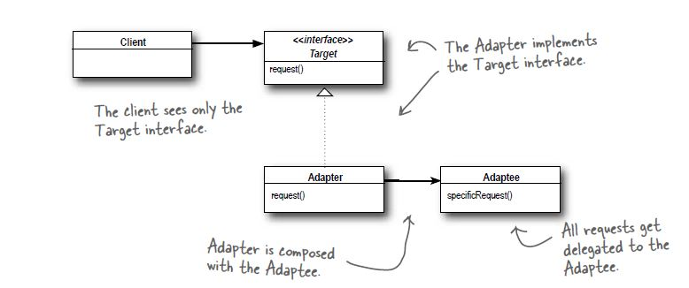

# Adapter Pattern

## Definition
The adapter pattern converts the interface of a class into another interface
the clients expect. Adapter lets classes work together that couldn't otherwise
because of incompatible interfaces

## When to use it ?
When you want to transform an interface to another interface.

## How to use it ?
1. You have a class that implements X interface and a client that need
a Y interface.
2. Create an adapter class that implements Y interface and composes a X
instance.
3. Delegate every method of Y interface to the X instance.

## Visual

