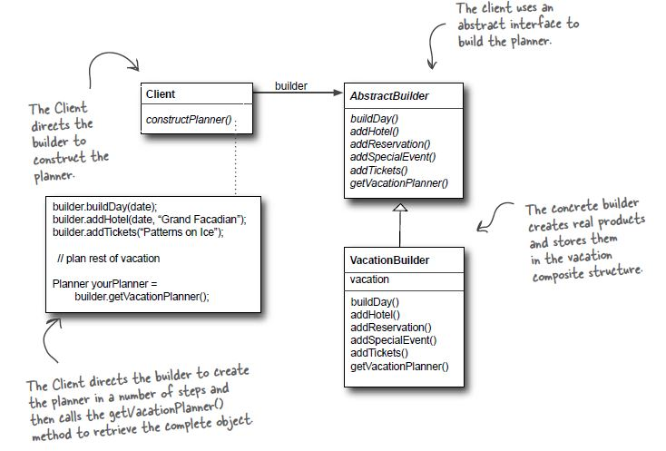

# Builder Pattern

## Definition
The intent of the Builder design pattern is to separate the construction
of a complex object from its representation. By doing so the same
construction process can create different representations

## When to use it ?
When you want to separate the construction of a complex object so that you
can create different representations of the objects, or to simplify the
construction of that object

## How to use it ?
1. Create a Builder interface, with setters for the variables of the object
we want to construct (**these methods return a Builder instance**),
and a build() method that returns the constructed object.
2. Create a concrete implementation of the interface in step 1, for each
representation of the object we want to construct (eg: if our object
is House, we can have a IglooHouseBuilder, TreeHouseBuilder etc.)
3. Create a xxxxDirector object that takes a interface of step2 and constructs
the object based on the concrete implementation of that interface.

## Visual

