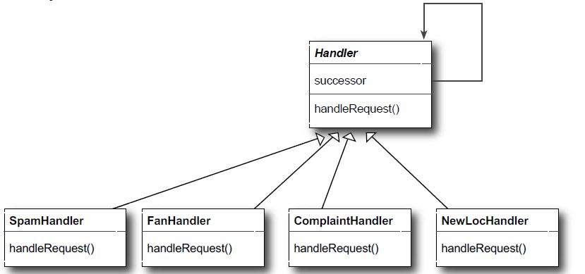

# Chain Of Responsibility Pattern

## Definition
Use the Chain of Responsibility Pattern when you want to give more than
one object a chance to handle a request.

## When to use it ?
When you have a sequence of if...else if...else if....... else... . You
can pass the request to the first object and call the next object if
the request need more processing.

## How to use it ?
1. Create an abstract class that has a reference of itself, a method to
set the next level to forward the request, a process method
that process the request and forward it to the next level, and abstract
methods that differ in each concrete implementation.
2. Create a set of concrete implementations for the abstraction in step 1

## Visual

