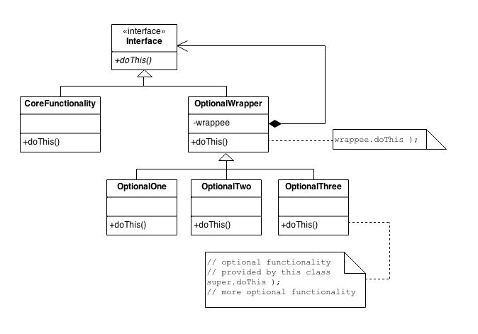

# Decorator Pattern

## Definition
The decorator pattern attached additional responsibilities to an object
dynamically. Decorators provide a flexible alternative to subclassing
for extending functionality.

## When to use it ?
Decorator is used when to add (decorate) an object with new behavior, during
runtime, or later in the development without tight coupling (extended).

## How to use it ?
1. Create an interface of the base class(es) what will be decorated in the future.
2. Implement the concrete classes against the interface that was already created.
3. Create an **abstract** class xxxxxDecorator
    1. You must implements the interface from step 1.
    2. Use composition and include an instance of the interface that was created in step 1
   (initialized in constructor).
    3. Implement all methods of the interface by delegating to the private interface instance.
4. Extend the abstract class xxxxxDecorator.
   1. The constructor takes an instance of the interface in step 1, and
      pass it to the super class.
   2. override all classes attaching functionality by calling the super class

## Visual

