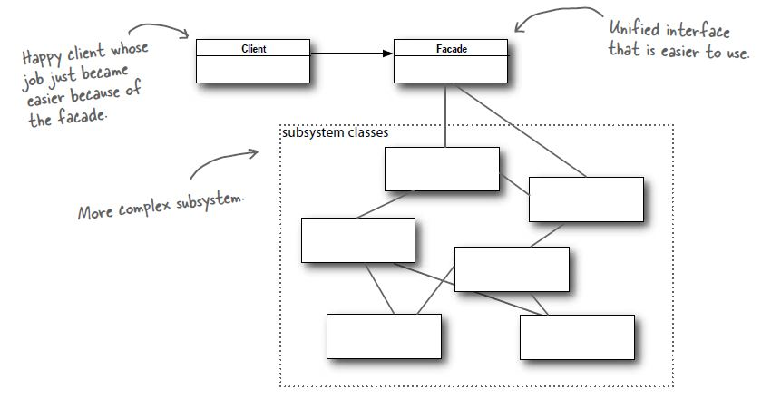

# Facade Pattern

## Definition
The facade pattern provides a unified interface to a set of interfaces in a
subsystem. Facade defines a higher-level interface that makes the subsystem
easier to use.

## When to use it ?
When you have a complex system and you want to add a facade (face) that
covers all the complexity and provides a simple easy to use interface.

## How to use it ?
1. Create a class/interface that exposes all the user-friendly API and under
 the covers uses the complex system.

## Visual

