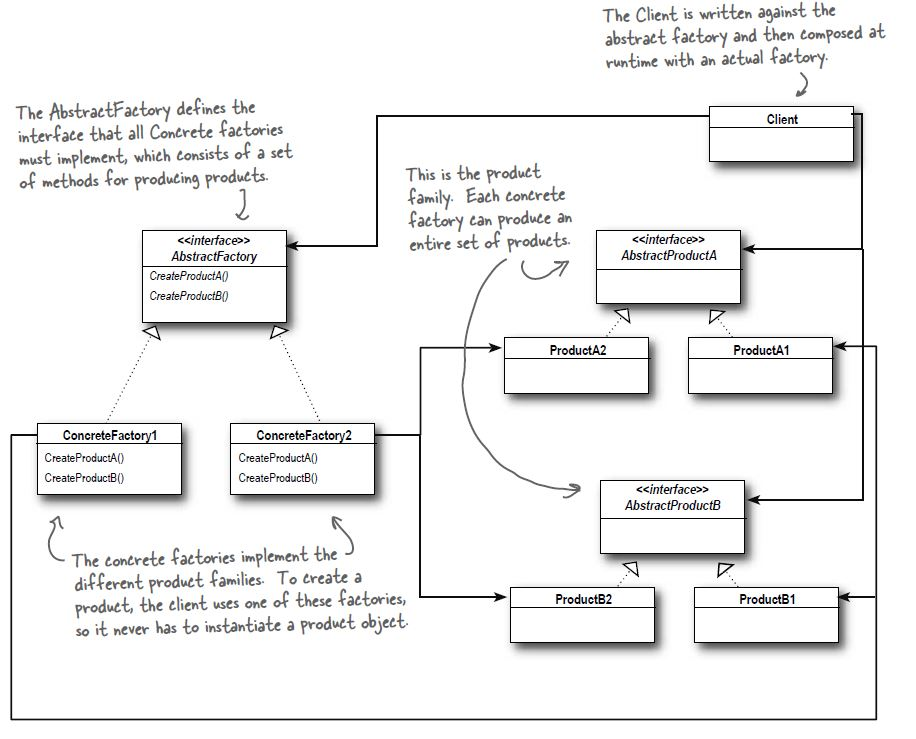

# Abstract Factory Pattern

## Definition
The Abstract Factory Pattern provides an interface for creating families
of related or dependent objects without specifying their concrete classes.

## When to use it ?
When you have families of products that you need to create and want to make sure
your client create products that belong together.

## How to use it ?
You have a set of products, that you want to create by passing a factory instance.

1. Group the related products and create an interface for them
(eg: tomato sauce & bbq sauce belong to the sauce interface)
2. Create a factory interface that creates a variety of products.
3. Create concrete implementations of the factory interface for each grouping of families of products.
(eg: greek ingredients are Feta(Concrete implementation of product) Cheese (interface of related products)
and Tomato Sauce, while the italian products are Mozzarella Cheese and BBQ Sauce. )
4. In the client code use the interface of the factory to create the products.
Based on the concrete implementation of the factory interface (passed in the constructor)
different products will be created. The client code knows nothing about the concrete products!

## Visual

