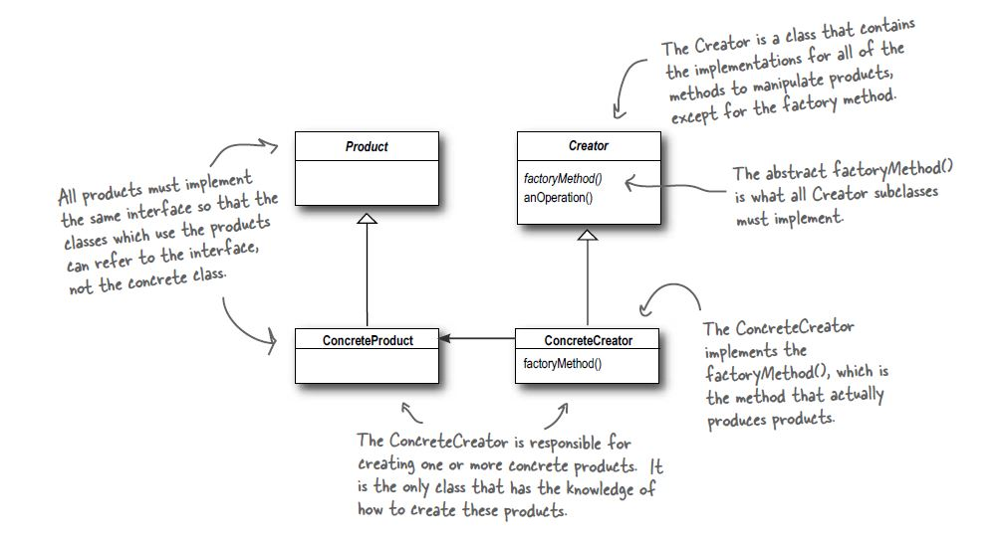

# Factory method Pattern

## Definition
The Factory Method Pattern defines an interface for creating an object,
but lets subclasses decide which class to instantiate. Factory Method lets
a class defer instantiation to subclasses.

## When to use it ?
When you need to decouple your client code from the concrete classes that you need
to instantiate, or you do not know ahead of time all the concrete classes you are
going to need.

## How to use it ?
As the name suggest this pattern is relied in an abstract method that is the
factory of new objects

1. Create an interface for the objects (products) that the factory method is going to create.
2. Make the class you want to add the factory method an abstract class, and
   and an abstract method that is the factory on new instances.
3. Use this abstract factory method when you need to create an object.
4. Extend the abstract class with concrete implementation for the abstracted
   factory method.

## Visual

