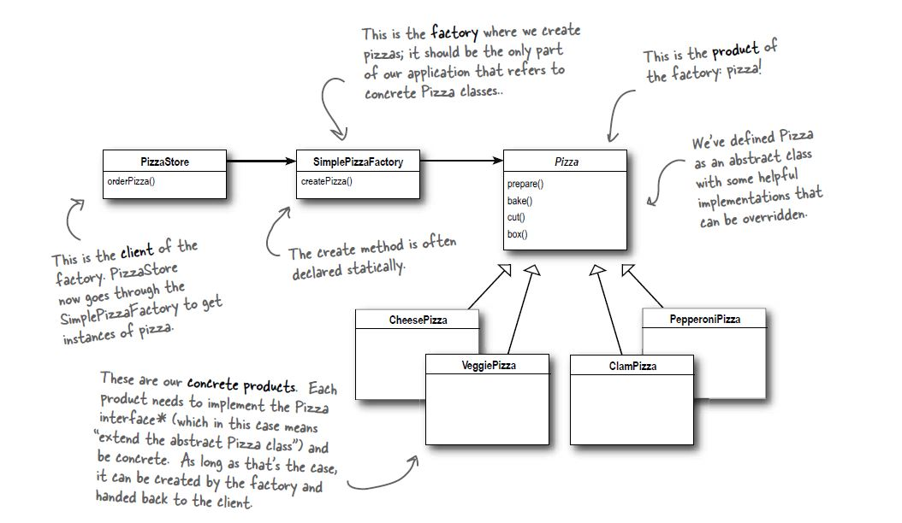

# Simple Factory Pattern

## Definition
This is not a "official pattern", so no official definition exists

## When to use it ?
When you have a list of a concrete implementations of an interface, and
you want a **simple** object that handles the creation of them during run-time instead
of having a series of *new* statements on every class.

## How to use it ?
1. Create an abstract class/interface for the list of objects we want to create a factory.
2. Create a method (factory) that given a specific input returns a concrete object of this interface in step 2.
3. Create concrete implementations of the interface, in the constructor takes the factory method.
4. When you want to create a new object call the factory method with the correct input.

## Visual

