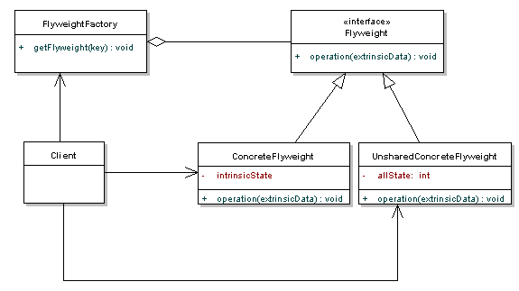

# Flyweight Pattern

## Definition
Use the Flyweight Pattern when one instance of a class
can be used to provide many “virtual instances.”

## When to use it ?
Flyweight pattern is used when we need to create a large number of similar objects (say 10^5)
and we want to reduce the memory footprint of the objects.
One important feature of flyweight objects is that they are immutable.
This means that they cannot be modified once they have been constructed.

## How to use it ?
1. Create the object we want to reduce the number of.
2. Create a factory object that that has a Map to hold a subset of objects.
   For example if you object is a Shape with X,Y coordinates and a color, because
   the coordinates may change a lot store the Objects with a key the color of the Circle.
3. When calling for different Objects set on the fly the state that change frequently
   (eg. the coordinates)

## Visual

