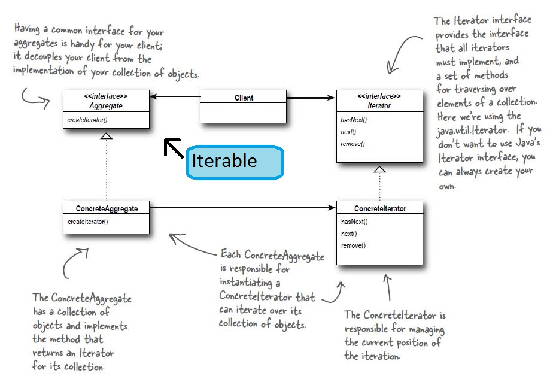

# Iterator Pattern

## Definition
The iterator pattern provides a way to access the elements of an aggregate
object sequentially without exposing its underlying representation

## When to use it ?
Use it when you want to access (sequentially) the elements of a aggregation
(collection, array etc.) without tight coupling with the underling aggregation.

## How to use it ?
1. Create an interface Iterator (or use the java.util.Iterator) with 2 methods
hasNext(), next().
2. Create a concrete implementation of this Iterator interface for each aggregation
you want to make iterable.
3. Create a Iterable interface with one method Iterator iterator() which return
an Iterator instance (or use the java.util.Iterable)
4. Implement the Iterable interface on the aggregation you want to make iterable
and on the iterator() method return the concrete Iterator implementation from
step 2.

## Visual

