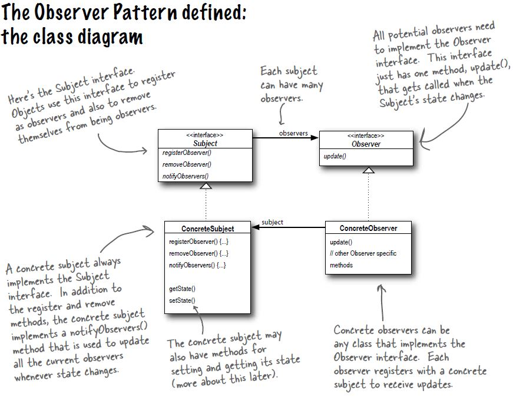

# Observer Pattern

## Definition
The observer pattern defines a one-to-many dependency between objects so that when one
object changes state, all of its dependents are notified and updated automatically.

## When to use it ?
When you have a subscribers-publisher model. Multiple objects want to know
when a specific object change state.

## How to use it ?
1. Create a Observer interface with an update(Subject s) method.
2. Create a Subject interface with 3 methods
    1. addObserver(Observer o)
    2. removeObserver(Observer o)
    3. notifyObservers()
3. Implement the Observer interface in every object you make a observer (subscriber).
   Use (safe casting -instanceOf-) to cast the Subscriber to the concrete object
   and pull the updated data from exposed getters.
4. Implement the Subject interface in the object you want to make a publisher.
   Provide getters for the updated values.

## Visual

