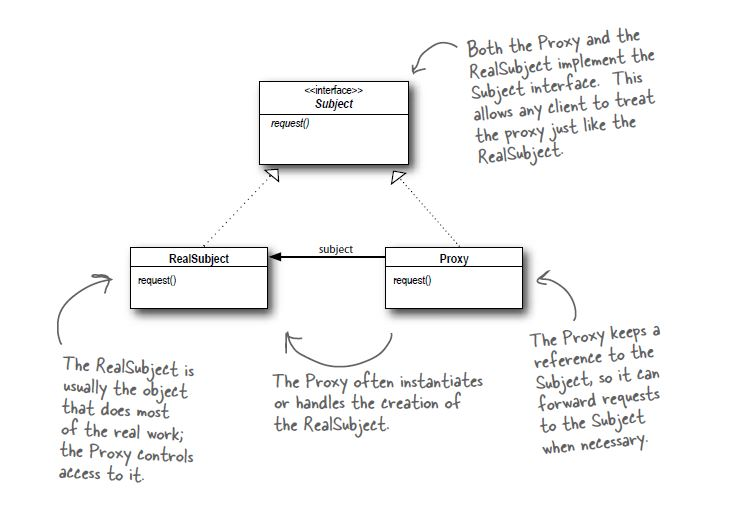

# Proxy Pattern

## Definition
The proxy pattern provides a surrogate or placeholder for another object
to control access to it

## When to use it ?
When you want to control the access to an underlying object. Types of proxy patterns:

- *Remote objects*: control access to remote objects (RMI).

- *Virtual objects*: control access to resources that are expensive.

- *Protection objects*: control access to resource bases on access rights.

## How to use it ?
1. Create the object you want protect ( Implement the interface in step 2)
2. Create an  Subject interface for the object you want to control access to,
with every method the protected object exposes.
3. Create the proxy object that implements the same interface as the protected object,
this objects compose the protected objects and delegate if need the calls to
that composed object

## Visual

