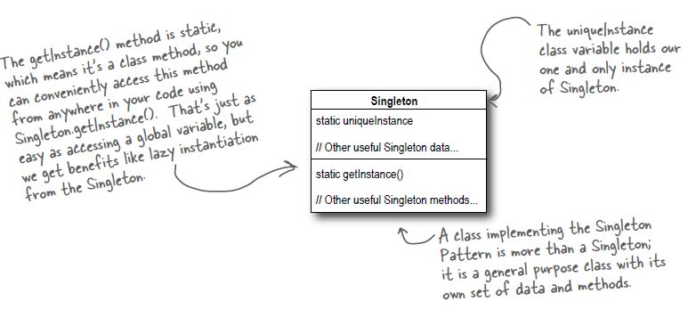

# Singleton Pattern

## Definition
The Singleton Pattern ensures a class has only one instance, and provides
a global point of access to it.

## When to use it ?
When you want to have only one instance of an object at all times.
Keep in mind that when you are in a multithreaded environment you need to
refactor the code to avoid multiple thread accessing the instantiation part.
There are 3 ways to do it:

1. Make getInstance() method synchronized. Easy but this will cause performance issues
even when the instance has been instantiated.
2. Do not use lazy instantiation. Instantiate the object in a static initializer
eg:
```
public class Singleton {
    private static Singleton uniqueInstance = new Singleton();

    private Singleton() {}
    public static Singleton getInstance() {
        return uniqueInstance;
    }
}
```
3. Use double-checked-locking
```
  public class Singleton {
    //Volatile ensures that multiple threads handle the uniqueInstance variable correctly
    //when it is being initialized
    private volatile static Singleton uniqueInstance;

    private Singleton() {}
    public static Singleton getInstance() {
        if (uniqueInstance == null) {
            synchronized (this) {
            if (uniqueInstance == null) {
                uniqueInstance = new Singleton();
                }
            }
    }
    return uniqueInstance;
    }
  }
```

## How to use it ?
1. Make the object's constructor private.
2. Add a private static instance of the object inside the object.
3. Create a static getInstance() method that if the static instance is null
   instantiates the object, and returns it, else it just return the static instance.


## Visual


