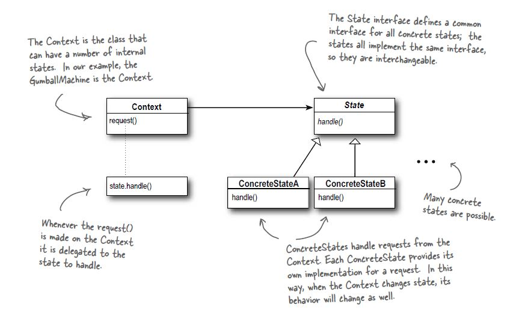

# State Pattern

## Definition
The state pattern  allows an object to alter its behavior when its internal
state changes. The object will appear to change its class.

## When to use it ?
When the system behavior depends on the state it is. The system
will need to **self-change** its behavior/state during runtime.

State vs Strategy pattern: in the state pattern the system self-changes the
state/behavior it is in, while in the Strategy pattern this is done by the
client.

## How to use it ?
1. Create a state diagram.
2. Create a Context class that in handles the requests by foreign clients,
It holds the current state of the system as well as every method (aka every action in
the class diagram) of the API exposed by the system.
3. Create an interface State with every available action an the state diagram of
our system.
4. Implement the State interface for every available state of our system (based on the
state diagram). The concrete classes compose a reference to the Context class
in order to change the State if needed.

## Visual

