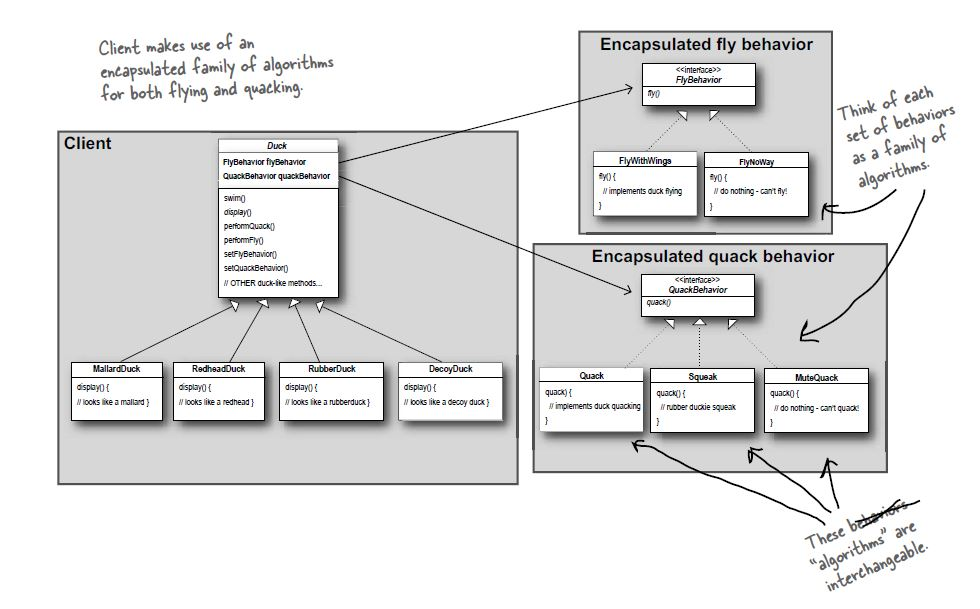

# Strategy Pattern

## Definition
The strategy pattern defines a family of algorithms,
encapsulates each one, and makes them interchangeable.
Strategy let's the algorithm vary independently from clients that use it.

## When to use it ?
When you have behavior of a class that may change in the future,
(in the development life or during runtime).

## How to use it ?
1. First define the parts (behaviors/algorithms...) of the class that
   may change and group them together.
2. Create a common interface for each group.
3. Implement the each part (behavior/algorithm...) you need against the interface.
4. Encapsulate the interfaces in the (abstract) class you need the loosely
   coupled  part (behavior/algorithm...). Use inversion of control to
   change them during run time.

## Visual

