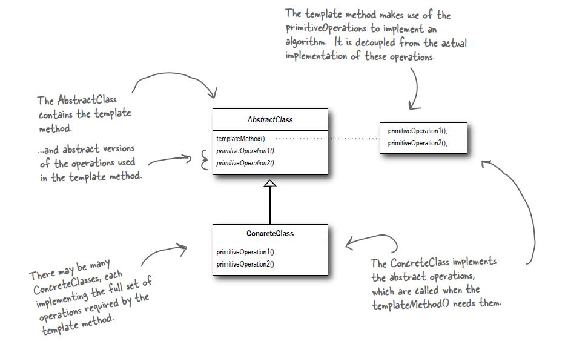

# Template Method Pattern

## Definition
The template Method Pattern defines the skeleton of an algorithm in a method,
deferring some steps to subclasses. Template method lets subclasses redefine
certain steps of an algorithm without changing the algorithm's structure.

## When to use it ?
When you have a set of similar algorithms that differ in a few steps. The
goal is to merge them together and use a template method to run them.

It may seems similar to the strategy pattern but there is one difference:
In the strategy pattern all the algorithm is encapsulated and is decoupled.
Here only a few small parts of the algorithm differ, and we delegate them
to subclasses.

## How to use it ?
1. Given a set o similar algorithms define the steps that are the same
and the steps that differ.
2. Create an abstract class that has one **final method** that provides a
template for all the steps of the algorithm (similar & different).
3. The methods that are similar to all algorithms are implemented in the
abstract class.
4. Methods that are different are set as abstract to the abstract class
5. Create concrete implementations of the abstract class that define
the steps that differ.

## Visual

